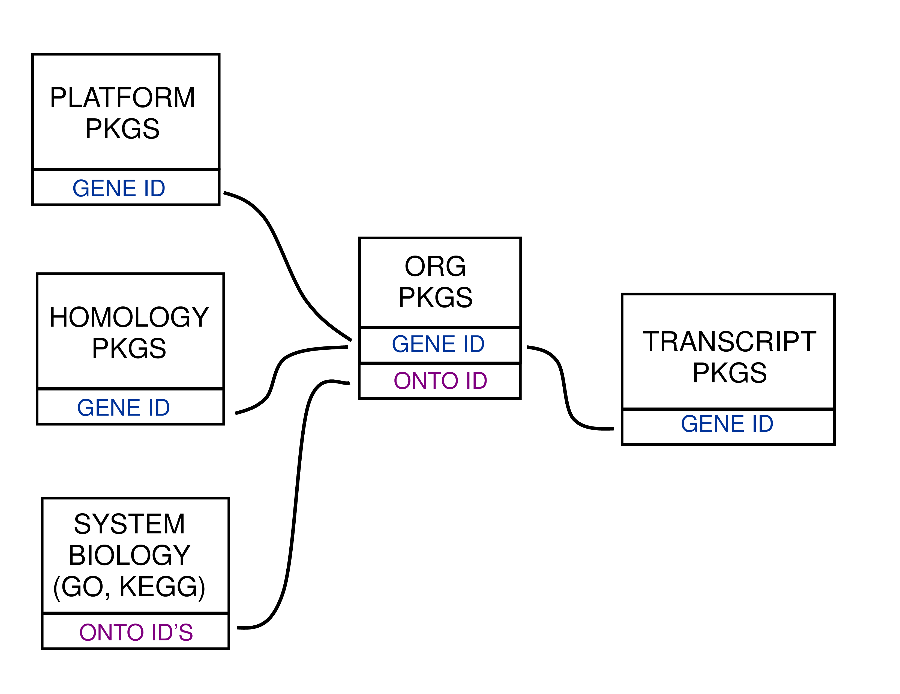

```{r dbtypes, fig.cap = "Annotation Packages: the big picture", echo = FALSE, fig.width=0.6}

```

*Bioconductor* provides extensive annotation resources. These can be
*gene centric*, or *genome centric*. Annotations can be provided in packages
curated by *Bioconductor*, or obtained from web-based resources. This vignette
is primarily concerned with describing the annotation resources that are
available as packages. More advanced users who wish to learn about how to make
new annotation packages should see the vignette titled "Creating select
Interfaces for custom Annotation resources" from the 
`r Biocpkg("AnnotationForge")` package.

Gene centric `r Biocpkg("AnnotationDbi")` packages include: 

- Organism level: e.g. `r Biocpkg("org.Mm.eg.db")`. 
- Platform level: e.g. `r Biocpkg("hgu133plus2.db")`, 
`r Biocpkg("hgu133plus2.probes")`, `r Biocpkg("hgu133plus2.cdf")` 
- System-biology level: `r Biocpkg("GO.db")`


Genome centric `r Biocpkg("GenomicFeatures")` packages include

-   Transcriptome level: e.g. `r Biocpkg("TxDb.Hsapiens.UCSC.hg19.knownGene")`,
`r Biocpkg("EnsDb.Hsapiens.v75")`.
-   Generic genome features: Can generate via `r Biocpkg("GenomicFeatures")`

One web-based resource accesses [biomart](http://www.biomart.org/), via the 
`r Biocpkg("biomaRt")` package: 

- Query web-based \`biomart' resource for genes,
sequence, SNPs, and etc.

The most popular annotation packages have been modified so that they can make
use of a new set of methods to more easily access their contents. These
four methods are named: `columns`, `keytypes`, `keys` and `select`. And they are
described in this vignette. They can currently be used with all chip, organism,
and `TxDb` packages along with the popular `r Biocpkg("GO.db")` package.

For the older less popular packages, there are still convenient ways to
retrieve the data. The *How to use bimaps from the ".db" annotation packages*
vignette in the `r Biocpkg("AnnotationDbi")` package is a key reference for
learnign about how to use bimap objects.

Finally, all of the \`.db' (and most other *Bioconductor* annotation packages)
are updated every 6 months corresponding to each release of *Bioconductor*.
Exceptions are made for packages where the actual resources that the packages
are based on have not themselves been updated.

# AnnotationDb objects and the select method

As previously mentioned, a new set of methods have been added that allow a
simpler way of extracting identifier based annotations. All the annotation
packages that support these new methods expose an object named exactly the same
as the package itself. These objects are collectively called *AnnotationDb*
objects for the class that they all inherit from. The more specific classes (the
ones that you will actually see in the wild) have names like *OrgDb*, *ChipDb*
or *TxDb* objects. These names correspond to the kind of package (and underlying
schema) being represented. The methods that can be applied to all of these
objects are `columns`, `keys`, `keytypes` and `select`.

In addition, another accessor has recently been added which allows extraction of
one column at a time. the `mapIds` method allows users to extract data into
either a named character vector, a list or even a SimpleCharacterList. This
method should work with all the different kinds of *AnnotationDb* objects
described below.

# ChipDb objects and the select method

An extremely common kind of `r Biocpkg("Annotation")` package is the so called
platform based or chip based package type. This package is intended to make the
manufacturer labels for a series of probes or probesets to a wide range of
gene-based features. A package of this kind will load an *ChipDb* object. Below
is a set of examples to show how you might use the standard 4 methods to
interact with an object of this type.

First we need to load the package:

```{r loadChip}
suppressPackageStartupMessages({
    library(hgu95av2.db)
})
```

If we list the contents of this package, we can see that one of the many things
loaded is an object named after the package "hgu95av2.db":

```{r listContents}
ls("package:hgu95av2.db")
```

We can look at this object to learn more about it:

```{r show}
hgu95av2.db
```

If we want to know what kinds of data are retriveable via `select`, then we
should use the `columns` method like this:

```{r columns}
columns(hgu95av2.db)
```

If we are further curious to know more about those values for columns, we can
consult the help pages. Asking about any of these values will pull up a manual
page describing the different fields and what they mean.

```{r help, eval=FALSE}
help("SYMBOL")
```

If we are curious about what kinds of fields we could potentially use as keys to
query the database, we can use the `keytypes` method. In a perfect world, this
method will return values very similar to what was returned by `columns`, but in
reality, some kinds of values make poor keys and so this list is often shorter.

```{r keytypes}
keytypes(hgu95av2.db)
```

If we want to extract some sample keys of a particular type, we can use the
`keys` method.

```{r keys}
head(keys(hgu95av2.db, keytype="SYMBOL"))
```

And finally, if we have some keys, we can use `select` to extract them. By
simply using appropriate argument values with select we can specify what keys we
want to look up values for (keys), what we want returned back (columns) and the
type of keys that we are passing in (keytype)

```{r selectChip}
#1st get some example keys
k <- head(keys(hgu95av2.db,keytype="PROBEID"))
# then call select
select(hgu95av2.db, keys=k, columns=c("SYMBOL","GENENAME"), keytype="PROBEID")
```

And as you can see, when you call the code above, select will try to return a
data.frame with all the things you asked for matched up to each other.

Finally if you wanted to extract only one column of data you could instead use
the mapIds method like this:

```{r mapIdsChip}
#1st get some example keys
k <- head(keys(hgu95av2.db,keytype="PROBEID"))
# then call mapIds
mapIds(hgu95av2.db, keys=k, column=c("GENENAME"), keytype="PROBEID")
```

# OrgDb objects and the select method

An organism level package (an 'org' package) uses a central gene identifier
(e.g. Entrez Gene id) and contains mappings between this identifier and other
kinds of identifiers (e.g. GenBank or Uniprot accession number, RefSeq id,
etc.). The name of an org package is always of the form org.\<Ab>\.\<id>\.db
(e.g.`r Biocpkg("org.Sc.sgd.db")`where \<Ab>\ is a 2-letter abbreviation of the
organism (e.g.`r Biocpkg("Sc")` for *Saccharomyces cerevisiae*) and \<id>\ is an
abbreviation (in lower-case) describing the type of central identifier (e.g.
`r Biocpkg("sgd")` for gene identifiers assigned by the Saccharomyces Genome
Database, or `r Biocpkg("eg")` for Entrez Gene ids).

Just as the chip packages load a *ChipDb* object, the org packages will load a
*OrgDb* object. The following exercise should acquaint you with the use of these
methods in the context of an organism package.

**Exercise 1**

*Display the OrgDb object for the `r Biocpkg("org.Hs.eg.db")`
package.*

*Use the `columns` method to discover which sorts of annotations can be extracted
from it. Is this the same as the result from the `keytypes` method?  Use the
`keytypes` method to find out.*

*Finally, use the `keys` method to extract UNIPROT identifiers and then pass
those keys in to the `select` method in such a way that you extract the gene
symbol and KEGG pathway information for each.  Use the help system as needed to
learn which values to pass in to columns in order to achieve this.*

**Solution:**

```{r}
library(org.Hs.eg.db)
columns(org.Hs.eg.db)
```

```{r}
help("SYMBOL") ## for explanation of these columns and keytypes values
keytypes(org.Hs.eg.db)
```

```{r}
uniKeys <- head(keys(org.Hs.eg.db, keytype="UNIPROT"))
cols <- c("SYMBOL", "PATH")
select(org.Hs.eg.db, keys=uniKeys, columns=cols, keytype="UNIPROT")
```

So how could you use select to annotate your results? This next exercise should
hlep you to understand how that should generally work.

**Exercise 2**

*Please run the following code snippet (which will load a fake data result that 
I have provided for the purposes of illustration):*

```{r selectData}
load(system.file("extdata", "resultTable.Rda", package="AnnotationDbi"))
head(resultTable)
```

*The rownames of this table happen to provide entrez gene identifiers for each
row (for human). Find the gene symbol and gene name for each of the rows in
resultTable and then use the merge method to attach those annotations to it.*


**Solution:**

```{r}
annots <- select(org.Hs.eg.db, keys=rownames(resultTable),
columns=c("SYMBOL","GENENAME"), keytype="ENTREZID")

resultTable <- merge(resultTable, annots, by.x=0, by.y="ENTREZID")
head(resultTable)
```

# Using select with GO.db

When you load the ` r Biocpkg("GO.db")` package, a *GODb* object is also loaded.
This allows you to use the `columns`, `keys`, `keytypes` and `select` methods on
the contents of the GO ontology. So if for example, you had a few GO IDs and
wanted to know more about it, you could do it like this:

```{r selectGO}
library(GO.db)
GOIDs <- c("GO:0042254","GO:0044183")
select(GO.db, keys=GOIDs, columns="DEFINITION", keytype="GOID")
```

# Using select with TxDb packages

A `r Biocpkg("TxDb")` package (a 'TxDb' package) connects a set of genomic
coordinates to various transcript oriented features. The package can also
contain Identifiers to features such as genes and transcripts, and the internal
schema describes the relationships between these different elements. All TxDb
containing packages follow a specific naming scheme that tells where the data
came from as well as which build of the genome it comes from.

**Exercise 3**

*Display the TxDb object for the `r Biocpkg("TxDb.Hsapiens.UCSC.hg19.knownGene")`
package.*

*As before, use the `columns` and `keytypes` methods to discover which sorts of
annotations can be extracted from it.*

*Use the `keys` method to extract just a few gene identifiers and then pass those
keys in to the `select` method in such a way that you extract the transcript ids
and transcript starts for each.*

**Solution:**

```{r selectTxDb}
library(TxDb.Hsapiens.UCSC.hg19.knownGene)
txdb <- TxDb.Hsapiens.UCSC.hg19.knownGene
txdb
columns(txdb)
keytypes(txdb)
keys <- head(keys(txdb, keytype="GENEID"))
cols <- c("TXID", "TXSTART")
select(txdb, keys=keys, columns=cols, keytype="GENEID")
```

As is widely known, in addition to providing access via the `select` method,
*TxDb* objects also provide access via the more familiar `transcripts`, `exons`,
`cds`, `transcriptsBy`, `exonsBy` and `cdsBy` methods. For those who do not yet
know about these other methods, more can be learned by seeing the vignette
called: *Making and Utilizing TxDb Objects* in the 
`r Biocpkg("GenomicFeatures")` package.

# Using select with EnsDb packages

Similar to the *TxDb* objects/packages discussed in the previous section,
*EnsDb* objects/packages provide genomic coordinates of gene models along with
additional annotations (e.g. gene names, biotypes etc) but are tailored to
annotations provided by Ensembl. The central methods `columns`, `keys`,
`keytypes` and `select` are all implemented for *EnsD* objects. In addition,
these methods allow also the use of the *EnsDb* specific filtering framework to
retrieve only selected information from the database (see vignette of the 
`r Biocpkg("ensembldb")` package for more information).

In the example below we first evaluate which columns, keys and keytypes are
available for *EnsDb* objects and fetch then the transcript ids, genomic start
coordinate and transcript biotype for some genes.

```{r selectEnsDb}
library(EnsDb.Hsapiens.v75)
edb <- EnsDb.Hsapiens.v75
edb

## List all columns
columns(edb)

## List all keytypes
keytypes(edb)

## Get the first
keys <- head(keys(edb, keytype="GENEID"))

## Get the data
select(edb, keys=keys, columns=c("TXID", "TXSEQSTART", "TXBIOTYPE"), 
       keytype="GENEID")
```

We can modify the queries above to retrieve only genes encoded on chromosome Y.
To this end we use filter objects available for *EnsDb* objects and its methods.

```{r selectEnsDb.Y}
## Retrieve all gene IDs of all lincRNAs encoded on chromosome Y
linkY <- keys(edb,
              filter=list(GeneBiotypeFilter("lincRNA"), SeqNameFilter("Y")))
length(linkY)

## We get now all transcripts for these genes.
txs <- select(edb, keys=linkY, columns=c("TXID", "TXSEQSTART", "TXBIOTYPE"),
              keytype="GENEID")
nrow(txs)

## Alternatively, we could specify/pass the filters with the keys argument.
txs <- select(edb, keys=list(GeneBiotypeFilter("lincRNA"), SeqNameFilter("Y")),
              columns=c("TXID", "TXSEQSTART", "TXBIOTYPE"))
nrow(txs)
```

The version number of R and packages loaded for generating the vignette were:

```{r SessionInfo, echo=FALSE}
sessionInfo()
```
